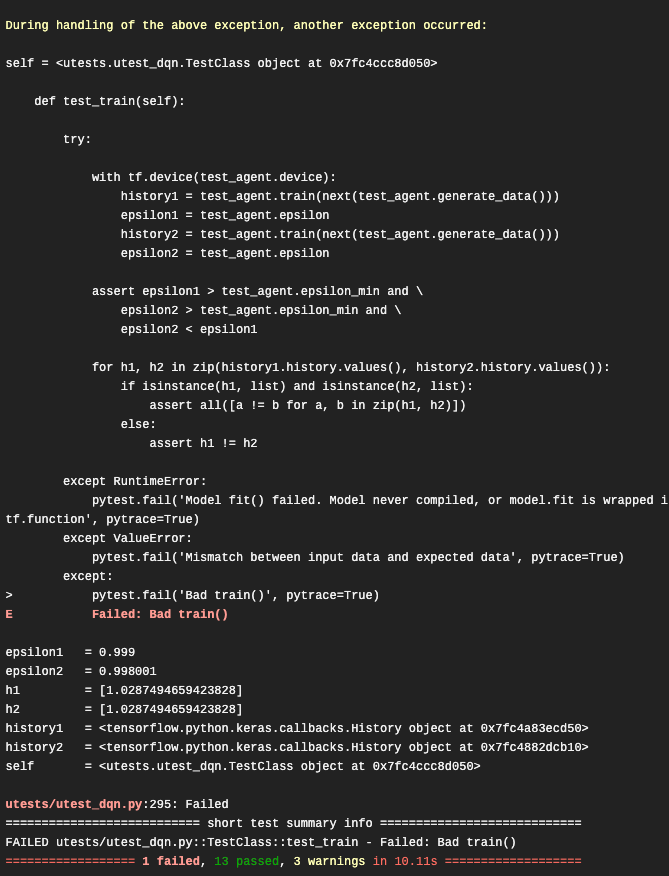

EXARL Unit Tests
================

Unit Testing for ExaRL
----------------------

A pytest based unit testing is implemented to evaluate ExaRL agents. So far this implementation is limited to a DQN agent in ExaRL.
Using this implementation as an example, more unit test cases can be implemented and  unit testing can be extended to evaluate other agents in ExaRL to generalize the unit testing for custom agents.

Unit Test Cases for DQN agent
-----------------------------

The pytest framework runs each test case method as an independent instance. Multiple test cases are grouped in a TestClass, as implemented in utest_dqn.py
Each method in TestClass, with a prefix test_*, will be run by the pytest framework as an independent instance. There are 14 such methods in TestClass, each dedicated for a specific unit test case.

* Test case 1: Tests MPI comm initialization

.. code-block:: python

   def test_initialize_parameters(self)

* Test case 2: Tests DQN agent's init(), which includes testing correct parameter configuration, and test if the model.compile() (LSTM and MLP) is executed correctly by the DQN agent.

.. code-block:: python

   def test_init(self)

* Test case 3: Tests if the set_learner() method of the DQN agent is correctly executed.

.. code-block:: python

   def test_set_learner(self)

* Test case 4: Test if remember() method of the DQN agent is correctly executed.

.. code-block:: python

   def test_remember(self)

* Test case 5: Tests is get_weights() method returns

.. code-block:: python

   def test_get_weights(self)

* Test case 6: Tests set_weights() methods corrects sets weights

.. code-block:: python

   def test_set_weights(self)

* Test case 7: Tests action() returns correct action value and policy value

.. code-block:: python

   def test_action(self)

* Test case 8: Tests generate_data() yields correctly from memory

.. code-block:: python

   def test_generate_data(self)

* Test case 9: Tests train() method to check if model.fit() is executed correctly inside train() by the DQN agent

.. code-block:: python

   def test_train(self)

* Test case 10: Tests target_train() methods to check if weights are updated

.. code-block:: python

   def test_target_train(self)

* Test case 11 to Test 14 are implemented to check if abstract methods are implemented in DQN agent.

.. code-block:: python

   def test_load(self)  # 11
   def test_save(self)  # 12
   def test_update(self)  # 13
   def test_monitor(self)  # 14

Run
---

The test methods (test_*) are executed by the pytest framework by running 'pytest' command from the ExaRL parent directory (exarl/).

.. code-block:: bash

   ExaRL/utests % cd ..
   ExaRL % pytest

The pytest command looks for the pytest.ini file in ExaRL.
The pytest.ini file is a configuration file used by the pytest framework. It includes command-line parameters and flags, which is specified by 'addopts'.

**pytest.ini**

.. code-block:: python

   addopts = --ignore=./envs --disable-warnings --showlocals --color=yes --code-highlight=yes

Other configuration parameters in pytest.ini are:

- python_files: It identifies \*.py files which are only run by pytest command.
- python_functions: It identifies the specific test functions only to be run inside a 'python_files' file.
- testpaths: It specifies folder names in ExaRL/ which are the only folders run by the pytest command.
- Other configurations are dedicated for logging.

The ``ExaRL/pytest.ini`` file looks like:

.. code-block::

   [pytest]
   addopts = --ignore=./envs --disable-warnings --showlocals --color=yes --code-highlight=yes
   python_files = utest_*.py
   python_functions = test_*
   testpaths = utests
   console_output_style = classic
   log_cli = True
   log_file_date_format = %Y-%m-%d %H:%M:%S
   log_file_format = %(asctime)s %(levelname)s %(message)s
   log_file = ./utests/logs/pytest-utest.log

Integration with Travis CI
--------------------------

The pytest framework for unit testing has been integrated with build test framework provided by Travis CI. Consequently, ExaRL/.travis.yml and ExaRL/setup.py files have been updated to take effect.

Examples
--------

- The live status logging for each test case is enabled. This shows whether a test case has PASSED or FAILED.

.. image:: ./images/allpass.png
   :width: 800

- To show a scenario when a test case fails, test_train() is used to check if the train() method in the DQN agent correctly executes model.fit(). This is done by comparing history objects from two different model.fit() runs. The history contains metrics returned by model.fit(). The following console output shows the failed test and a trace of the error occurred:

.. image:: ./images/trainfail1.png
   :width: 800

This error occurred because two values (such as loss, accuracy, etc) in the history metrics are exactly the same. This is not possible if the model.fit() is setup and run correctly. The final pytest results for this run shows that 1 test failed, and 13 tests passed.

